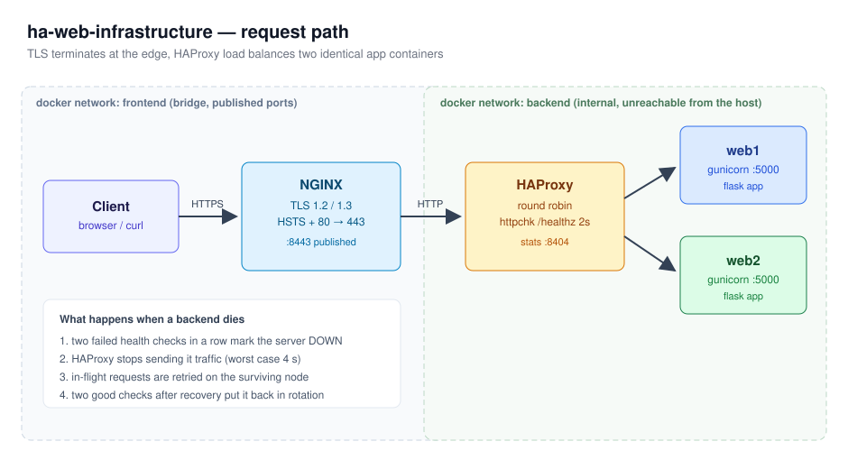

# High availability web stack (NGINX + HAProxy + Docker)

A small but complete highly available web tier I put together to understand what actually
happens when a backend server dies. Everything runs in Docker Compose, so the whole thing
comes up on a laptop in about a minute.

The short version: NGINX terminates TLS at the edge, HAProxy load balances two identical
application containers, and health checks pull a node out of rotation before users notice.



## Why I built it

Reading about load balancers only gets you so far. I wanted to see the failover with my own
eyes: how long the outage window really is, what HAProxy logs when a check fails, and whether
a request that was already in flight gets dropped or retried. The failover script at the
bottom answers all three.

## What's inside

| Piece | Image | Job |
|---|---|---|
| `edge` | nginx:1.27-alpine | TLS 1.2/1.3 termination, HTTP to HTTPS redirect, security headers |
| `balancer` | haproxy:2.9-alpine | round robin balancing, active health checks, stats page |
| `web1` / `web2` | python:3.12-slim | identical Flask apps behind gunicorn, each one reports its own name |

Two Docker networks. `frontend` is a normal bridge with the published ports, `backend` is
declared `internal: true`, so the app containers have no route to the host at all. The only
way in is through the edge, which is the point.

## Running it

```bash
./scripts/bootstrap.sh
```

That generates a self signed certificate if there isn't one, builds the app image and waits
until the edge answers. Then:

- site: <https://localhost:8443> (your browser will complain about the self signed cert, that's expected)
- HAProxy stats: <http://localhost:8404>

Refresh the site a few times. The page colour flips between blue and green because you are
being sent to a different container each time.

To tear it down:

```bash
docker compose down
```

## Testing the failover

```bash
./scripts/failover-test.sh
```

The script runs five phases and writes everything to `docs/last-run.log`:

1. Baseline traffic with both backends up, to confirm the round robin split.
2. A graceful drain: `web1` starts answering 503 on `/healthz` while still running. HAProxy
   should stop using it after two failed checks.
3. Recovery, to see it come back after two good checks.
4. A hard kill: the `web2` container is stopped in the middle of a continuous request loop.
   This is the interesting number, how many requests actually failed.
5. Steady state again once the container is back.

A run on my laptop:

```
[1] baseline, both backends healthy
round robin              web1=8    web2=8    failed=0

[2] graceful drain of web1 (health endpoint returns 503)
web1 draining            web1=0    web2=16   failed=0

[3] web1 back in the pool
recovered                web1=8    web2=8    failed=0

[4] hard failure: stopping the web2 container mid-traffic
traffic during kill      ok=51     failed=0

[5] steady state after restart
final                    web1=8    web2=8    failed=0
```

Phase 4 is the number I care about. Fifty one requests spanning the moment a backend was killed,
none of them failed. The `retries 2` and `option redispatch` lines in `haproxy/haproxy.cfg` are
what buy that: a request that was already on its way to the dead server gets sent to the other
one instead of returning a 503. Take those two lines out and rerun the script, the difference is
obvious.

## What I learned

- Health check tuning is a tradeoff, not a best practice. `inter 2s fall 2` gives a worst case
  four second detection window. Making it more aggressive detects faster but starts flapping
  on a slow backend.
- `proxy_next_upstream` on the NGINX side and `option redispatch` on the HAProxy side solve the
  same problem at different layers, and you want both. One covers the balancer being unreachable,
  the other covers a single backend dying mid request.
- An `internal: true` Docker network is a genuinely useful security boundary and costs nothing.
  I use the same idea in my bastion host lab.
- The default HAProxy `timeout connect` of 5 s is far too generous for containers on the same
  host. Dropping it to 2 s made failures fail fast instead of hanging.
- Self signed certificates are fine for a lab but `curl` needs `-k` everywhere, which is a good
  reminder of why certificate validation exists.

## Things I'd add next

Keepalived with a floating IP so the edge itself isn't a single point of failure, and shipping
the HAProxy stats into the Prometheus setup from my monitoring lab instead of eyeballing the
stats page.
